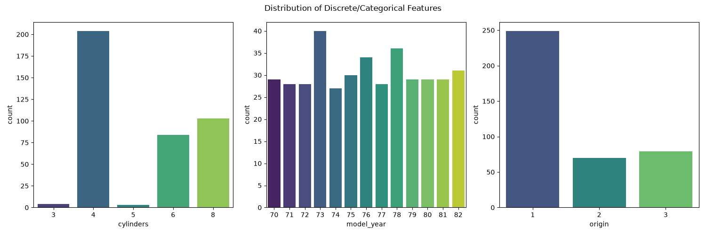

# Data Profile Report (Phase 1 - EDA)

## 1. Goal
Phân tích và hiểu đặc điểm của bộ dữ liệu Auto-MPG gốc.

## 2. Input
- Dataset: `auto-mpg.data`
- Số lượng mẫu: 398
- Số lượng đặc trưng: 9 (bao gồm target `mpg`)

## 3. Findings & Visual Insights

### Phân phối của các biến số (Numerical Distributions)

**Insight**: 
- `mpg` hơi lệch phải (right-skewed), tập trung ở dải 15-30 mpg. 
- `displacement` và `weight` có dạng phân phối đa mode (bimodal), gợi ý rằng xe có thể chia làm 2-3 phân khúc rõ rệt (xe nhỏ/nhẹ vs xe lớn/nặng).

### Phân phối của các biến phân loại (Categorical Distributions)

**Insight**: 
- Đa số xe có 4 xi-lanh hoặc 8 xi-lanh. 
- Phần lớn xe xuất xứ từ vùng 1 (Mỹ). Điều này có thể gây ra mất cân bằng nhẹ nếu mô hình phụ thuộc quá nhiều vào origin.

### Đánh giá Ngoại lệ (Outlier Detection)

**Insight**: 
- Các biến `horsepower` và `acceleration` có vài giá trị ngoại lệ (chấm đen ngoài râu boxplot). 
- Tuy nhiên, xem xét khía cạnh thực tế, đây là thông số của các dòng xe hiệu năng cao hoặc đặc biệt chậm, không phải do lỗi đo lường, nên cần giữ lại.

### Ma trận Tương quan (Correlation Matrix)

**Insight**: 
- Đa cộng tuyến (Multicollinearity) cực kỳ mạnh giữa `cylinders`, `displacement`, `weight`, và `horsepower` (hệ số > 0.89).
- Tất cả các biến này đều tương quan nghịch mạnh với `mpg`. Xe càng to, càng nặng, xi-lanh càng lớn thì càng tốn nhiên liệu.

### Tương quan Feature vs Target

**Insight**: 
- Quan hệ giữa `displacement`, `horsepower`, `weight` với `mpg` rõ ràng là **phi tuyến tính (non-linear)**, có dạng cong lồi. 
- Đây là insight cực kỳ giá trị, cho thấy **Polynomial Regression** sẽ hoạt động tốt hơn hẳn Linear Regression thông thường!

## 4. Decision
- Dữ liệu hoàn toàn khả thi để dự đoán.
- Tiến hành **Bước 2 - Data Cleaning**: Xử lý 6 missing values của `horsepower`, xóa cột ID `car_name`, và giữ nguyên outlier.
