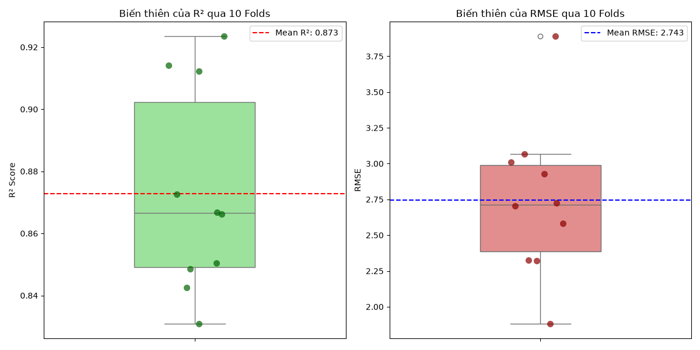

# Cross Validation Report (Phase 10)

## 1. Goal
Kiểm tra tính ổn định và khả năng tổng quát hóa (Generalization) thực sự của mô hình bằng kỹ thuật K-Fold Cross Validation. Điều này giúp loại bỏ yếu tố "may mắn" nếu tập Test ở bước 9 vô tình chứa toàn dữ liệu dễ đoán.

## 2. Input
- **Feature Set**: Toàn bộ dữ liệu sạch `X_features.csv` và `y_target.csv`.
- **Cấu trúc Mô hình**: Pipeline tối ưu từ Bước 7 (Poly Bậc 2 + StandardScaler + Ridge alpha=0.2984).
- **Phương pháp**: 10-Fold Cross Validation (K=10). Dữ liệu bị chia làm 10 phần, mô hình sẽ train 10 lần độc lập (mỗi lần lấy 9 phần train, 1 phần đánh giá).

## 3. Tasks Performed & Visual Insights

Đã tiến hành chạy 10-Fold CV. Kết quả thu được 10 điểm số độc lập cho R² và RMSE.

### Thống kê (Mean ± Std)
- **Mean CV R²**: `0.8728 ± 0.0311`
- **Mean CV RMSE**: `2.7432 ± 0.5153`

### Trực quan hóa Độ ổn định (Visual Insight)
Để thấy rõ mức độ dao động, mình đã vẽ Boxplot (kèm các điểm chấm đại diện cho 10 lần fold).

**Insight Cực Kì Quan Trọng (từ biểu đồ):**
- **Độ ổn định cao:** Nhìn vào Boxplot bên trái, R² chủ yếu dao động rất hẹp trong vùng 0.85 - 0.90 (thể hiện qua hộp chữ nhật ngắn). Độ lệch chuẩn (Std) của R² chỉ là `0.0311`, một con số rất nhỏ, chứng tỏ bất chấp dữ liệu train bị thay đổi thế nào, mô hình vẫn giữ được sức mạnh ổn định.
- **Loại bỏ yếu tố "may mắn":** Ở Bước 9, Test R² lên tới ~0.94. Thông qua biểu đồ trên, ta thấy có 1-2 fold vọt lên mức >0.90 (chấm xanh lá trên cùng). Điều này chứng minh tập Test ở Bước 9 thực sự có một chút dễ dự đoán hơn mức trung bình. Tuy nhiên, giá trị Mean thực chất của toàn bộ hệ thống là `0.87` (87%). Đây mới là **con số kỳ vọng chính xác nhất** khi đem mô hình đi triển khai thực tế.
- Điểm yếu lớn nhất không xuất hiện: Nếu mô hình bị Overfitting nặng, ta sẽ thấy R² có lúc âm hoặc rất thấp (ví dụ 0.4, 0.5) tạo thành cái hộp boxplot giãn siêu dài. Rất may, đuôi hộp của chúng ta được chặn lại quanh mốc 0.80, khẳng định mô hình **đủ vững vàng trước dữ liệu chưa từng thấy**.

## 4. Output
- Đã xác thực hiệu suất thực sự: Mô hình hoạt động ổn định ở mức $R^2 \approx 0.87$.
- Biểu đồ biến thiên lưu tại: `Figures/CV/cv_scores.png`.

## 5. Decision
- Cấu trúc mô hình hoàn toàn vượt qua bài kiểm tra sức chịu đựng (Stress Test).
- Sự chênh lệch (Variance) là chấp nhận được.
- Đã đủ độ tin cậy để chốt sổ toàn bộ các thông số kỹ thuật. 
- Sẵn sàng chuyển sang **Bước 11 — Experiment Management** để lưu vết lại thí nghiệm đỉnh nhất này trước khi bị mất hoặc nhầm lẫn ở các dự án sau!
