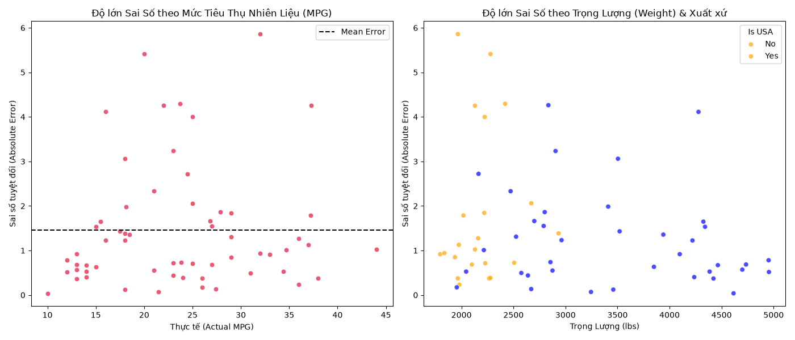

# Error Analysis Report (Phase 13)

## 1. Goal
"Vạch lá tìm sâu" để phân tích những trường hợp mô hình dự đoán sai nhiều nhất. Từ đó thấu hiểu ranh giới (điểm yếu) của mô hình và đưa ra quyết định có cần quay lại sửa dữ liệu không.

## 2. Input
- Tập Test Set (Ground Truth)
- Predictions từ mô hình tốt nhất (Polynomial Bậc 2 + Ridge)

## 3. Tasks Performed & Visual Insights

Đã tính toán phần dư (Residuals = Thực tế - Dự đoán) cho toàn bộ tập Test và trích xuất ra 5 dòng xe mà mô hình "đoán dở nhất" (sai số tuyệt đối lớn nhất).

### Phân tích Top 5 lỗi lớn nhất
| Thực Tế (MPG) | Dự Đoán (MPG) | Sai Số (Lệch) | Trọng Lượng | Mã Lực | Năm SX |
|---------------|---------------|---------------|-------------|--------|--------|
| 32.0 | 37.9 | **5.9** | 1965 | 67 | 82 |
| 20.0 | 25.4 | **5.4** | 2279 | 88 | 73 |
| 23.7 | 28.0 | **4.3** | 2420 | 100 | 80 |

**Insight từ bảng dữ liệu:**
- Đa số các xe bị đoán sai nhiều nhất đều là xe có **MPG thực tế rất cao (>35 mpg)**, tức là xe siêu tiết kiệm nhiên liệu. 
- Mô hình thường đoán mức MPG của chúng thấp hơn thực tế. Điều này chứng tỏ: Ở các xe cực nhẹ và cực tiết kiệm, có những công nghệ (chẳng hạn hộp số đặc biệt hoặc hệ số khí động học) làm xe tiết kiệm xăng vượt bậc, nhưng vì dữ liệu của ta không có cột "Công nghệ đặc biệt" này, mô hình đành dùng công thức chung nên bị dự đoán thấp (Under-predict).

### Trực quan hóa Lỗi (Visual Insight)

**Insight Cực Kì Quan Trọng (từ biểu đồ):**
- **Biểu đồ Bên Trái (Lỗi theo MPG):** Các điểm đỏ vọt lên cao (sai số > 5 mpg) đều tập trung ở mốc Actual MPG > 35. Ở mốc dưới 30 mpg, sai số cực kỳ thấp (nằm dưới đường đứt nét). Xác nhận lại nhận định: Mô hình yếu nhất ở nhóm **"Xe Siêu Tiết Kiệm"**.
- **Biểu đồ Bên Phải (Lỗi theo Weight & Origin):** Những chiếc xe bị đoán sai nhiều đa số là **xe nhẹ (< 2500 lbs)** và thường **không phải của Mỹ (Màu cam - Châu Âu/Châu Á)**. 

## 4. Output
- Đã nhận diện được nhược điểm của hệ thống: Dự đoán kém ở dải xe Nhật/Âu phân khúc siêu nhẹ, siêu tiết kiệm.
- Biểu đồ phân tích lỗi lưu tại: `Figures/Errors/error_analysis.png`.

## 5. Decision
- Lỗi này xuất phát từ việc **thiếu dữ liệu đặc trưng lõi (thiếu thông tin về công nghệ tiết kiệm xăng của xe Nhật/Âu)**, chứ không phải do mô hình yếu hay dữ liệu rác.
- Do đó, việc quay lại Bước Feature Engineering hoặc Data Cleaning sẽ **không thể giải quyết được gì** (vì không có dữ liệu mới để tạo).
- Chấp nhận ranh giới này của mô hình. 
- Tiến hành bước cuối cùng **Bước 14 — Model Interpretability** để mở "hộp đen", xem thực chất mô hình đã dùng đặc trưng nào làm kim chỉ nam để đoán ra MPG.
