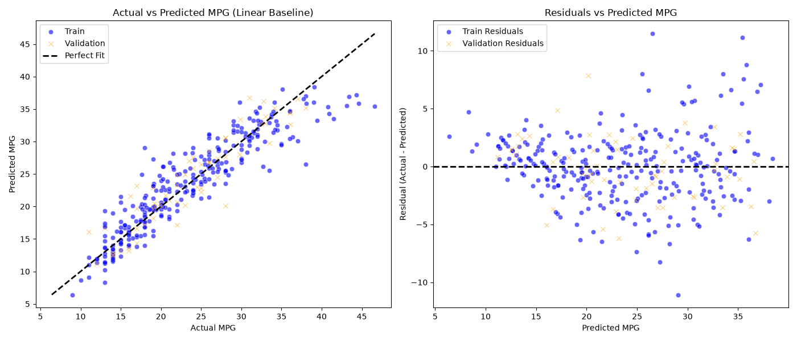

# Baseline Model Report (Phase 5)

## 1. Goal
Xây dựng một mốc so sánh tối thiểu (benchmark). Bất kỳ mô hình phức tạp nào (như Polynomial) sau này cũng bắt buộc phải đánh bại mốc này.

## 2. Input
- Dữ liệu: Tập Train (`X_train.csv`, `y_train.csv`) và Validation (`X_val.csv`, `y_val.csv`).
- Mô hình: `Linear Regression` kết hợp với `StandardScaler` (thông qua `sklearn.pipeline.Pipeline`). Việc thiết lập Pipeline đảm bảo Scaler chỉ được fit trên tập Train, tuân thủ tuyệt đối quy tắc chống **Data Leakage**.

## 3. Tasks Performed & Visual Insights

### Kết quả Metrics
- **Train Set:**
  - MSE: 9.6520 | RMSE: 3.1068
  - MAE: 2.3109 | $R^2$: 0.8454
- **Validation Set:**
  - MSE: 7.4553 | RMSE: 2.7304
  - MAE: 2.1784 | $R^2$: 0.8481

### Trực quan hóa & Đánh giá lỗi (Visual Insight)
Để hiểu rõ Linear Regression đơn thuần hoạt động ra sao, mình đã vẽ 2 biểu đồ: Thực tế vs Dự đoán, và Biểu đồ phần dư (Residuals).

**Insight Cực Kì Quan Trọng (từ biểu đồ Residuals):**
- Biểu đồ bên trái (Actual vs Predicted) cho thấy model dự đoán ở mức khá (R2 = 0.85), nhưng các điểm dữ liệu bị cong vòng khỏi đường nét đứt (đường hoàn hảo).
- **Đặc biệt nhìn vào biểu đồ bên phải (Residuals):** Phần dư (sai số) KHÔNG phân bố ngẫu nhiên quanh trục 0. Nó tạo thành một đường cong rõ rệt (hình chữ U ngược). Ở mức dự đoán thấp (15 mpg) và mức cao (35 mpg), model thường dự đoán sai theo cùng một hướng.
- Hiện tượng phần dư có hình dạng (pattern) báo hiệu một điều: **Mô hình tuyến tính quá đơn giản (Underfitting) để nắm bắt mối quan hệ cong của dữ liệu.** 

## 4. Output
- Baseline Metrics ghi nhận $R^2$ = 0.8481 và RMSE = 2.7304 trên tập Validation.
- Biểu đồ phân tích hiệu suất lưu tại `Figures/Baseline/baseline_performance.png`.

## 5. Decision
- Kết quả Baseline $R^2$ ~ 0.85 là mốc so sánh tối thiểu.
- Biểu đồ Residuals đã chứng minh đanh thép rằng dữ liệu có tính chất phi tuyến tính. Quyết định: Chuyển sang **Bước 6 — Model Selection** để thử nghiệm mô hình Polynomial Regression nhằm giải quyết đường cong sai số này!
