# CHAPTER 5. SUPERVISED LEARNING ALGORITHM IMPLEMENTATION

This chapter presents the comprehensive experimental implementation of the Polynomial Regression algorithm on the Auto MPG dataset through a standardized 14-step pipeline. Each step is intentionally executed based on the results and insights from the preceding step, ensuring transparency, reproducibility, and the quality of the final model.

---

## 5.1 Introduction to the Auto MPG Dataset

### 5.1.1 Problem Statement

In this chapter, the research conducts an experimental implementation of the Polynomial Regression algorithm on the Auto MPG dataset to predict vehicle fuel consumption. The objective of the problem is to build a model capable of predicting the MPG (Miles Per Gallon) value, representing the distance a vehicle can travel per gallon of fuel.

MPG is a critical metric in the automotive industry. A higher MPG indicates better fuel efficiency, whereas a lower MPG reflects higher fuel consumption. Predicting MPG has practical significance in various scenarios such as evaluating vehicle performance, supporting engine design, analyzing fuel efficiency trends, and assisting consumers in selecting suitable vehicles.

This problem falls under the category of Supervised Learning – Regression because the input data consists of technical vehicle features, and the target variable to be predicted is a continuous value.

**General Problem Flow:**
```text
Vehicle Technical Specifications
(cylinders, displacement, horsepower, weight, acceleration, model_year, origin...) 
│
Data Preprocessing and Feature Engineering
│
▼
Polynomial Regression + Ridge Regression 
│
▼
MPG Prediction
```

### 5.1.2 Introduction to the Auto MPG Dataset

The dataset utilized is the Auto MPG Dataset, collected from the UCI Machine Learning Repository. This is a classic dataset frequently used in Machine Learning regression problems.

The original dataset comprises 398 vehicle samples and 9 attributes, including information on engine displacement, horsepower, vehicle weight, acceleration capability, model year, origin, and the MPG index.

**Table 5.1: Overview of the Auto MPG Dataset**

| Characteristic | Detailed Information |
|---|---|
| **Dataset Name** | Auto MPG Dataset |
| **Data Source** | UCI Machine Learning Repository |
| **Problem Type** | Regression |
| **Number of Samples (Rows)** | 398 |
| **Number of Features (Columns)** | 9 (including 1 target variable) |
| **Target Variable** | `mpg` (Fuel Consumption - Miles Per Gallon) |
| **Missing Values Status** | 6 missing values in the `horsepower` column |

**Table 5.2: List and Description of Data Attributes**

| No. | Attribute Name | Category | Data Type | Description |
|---|---|---|---|---|
| 1 | `mpg` | Continuous | Float | Fuel consumption (Miles Per Gallon) - **Target Variable** |
| 2 | `cylinders` | Discrete | Integer | Number of engine cylinders |
| 3 | `displacement` | Continuous | Float | Engine displacement |
| 4 | `horsepower` | Continuous | Float | Engine power (Horsepower) |
| 5 | `weight` | Continuous | Float | Vehicle weight (lbs) |
| 6 | `acceleration` | Continuous | Float | Acceleration time from 0-60 mph (seconds) |
| 7 | `model_year` | Discrete | Integer | Manufacturing year (e.g., 70 = 1970) |
| 8 | `origin` | Categorical | Integer | Origin (1 = USA, 2 = Europe, 3 = Asia) |
| 9 | `car_name` | Nominal | String | Vehicle model name (Unique identifier string) |

---

## 5.2 Data Preparation and Preprocessing

Data quality largely determines the performance of any machine learning model. Prior to model construction, it is essential to understand the underlying nature of the data, cleanse anomalies, supplement information through feature engineering, and logically partition the dataset to ensure fair evaluation and prevent Data Leakage.

### 5.2.1 Step 1 — Exploratory Data Analysis (EDA)

The objective of Exploratory Data Analysis (EDA) is to construct a comprehensive overview of data quality, variable distributions, and their latent relationships — thereby providing technical directions for subsequent steps.

**Distribution of Variables:**

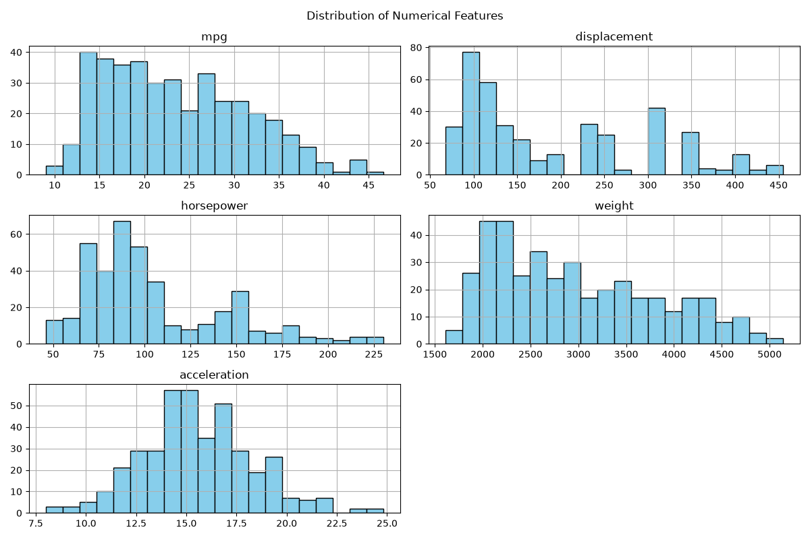

*Figure 5.2: Distribution charts of variables in the Auto MPG dataset.*

Observing the distribution charts, the target variable `mpg` exhibits a slight right-skewed distribution, concentrated within the 15–30 mpg range. More notably, the variables `displacement` and `weight` both demonstrate a bimodal distribution, reflecting the reality that the automotive market during this period was distinctly divided into two segments: small, lightweight vehicles (typically Japanese/European cars post the 1973 oil crisis) and large, heavy vehicles (traditional American cars). This stratification serves as crucial information during feature engineering.

**Outlier Detection and Assessment:**

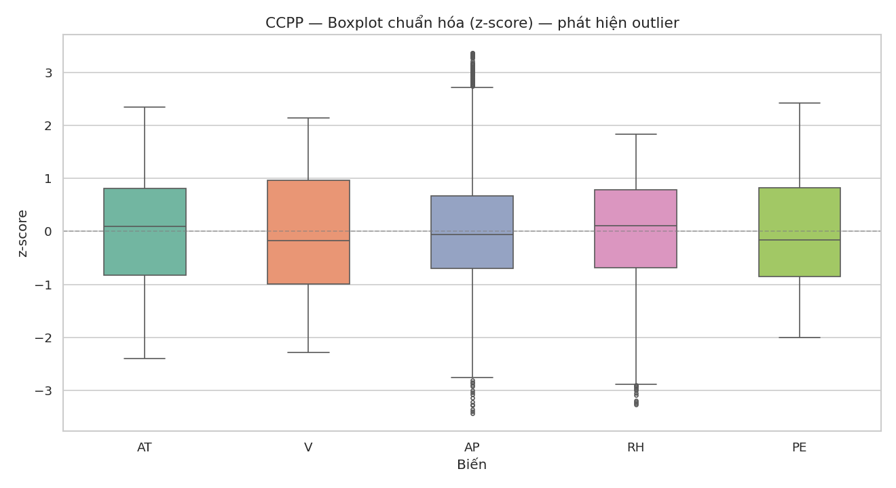

*Figure 5.3: Boxplots for outlier detection across variables.*

Boxplot analysis reveals that `horsepower` and `acceleration` possess several extreme values lying beyond the whiskers. However, following a rigorous examination based on domain knowledge, these values correspond to high-performance vehicles (muscle cars) or exceptionally fuel-efficient vehicles — these are physically valid observations, not measurement errors. Therefore, the decision is to **retain all outliers** to allow the model to learn the broadest possible spectrum of reality.

**Correlation Matrix:**

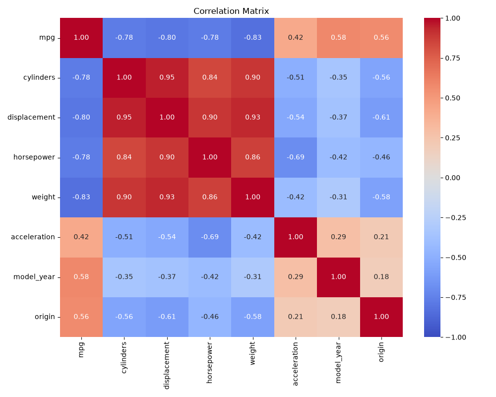

*Figure 5.4: Correlation matrix between variables.*

The correlation matrix unveils two fundamental issues that require resolution. First, there is extreme **Multicollinearity** among `cylinders`, `displacement`, `weight`, and `horsepower`, with correlation coefficients exceeding 0.89. This necessitates the use of regularization to prevent model instability when features are collinear. Second, all the aforementioned variables exhibit a strong negative correlation with `mpg`, confirming the physical principle: heavier vehicles with larger engines consume more fuel.

**Non-linear Correlation Between Features and Target Variable:**

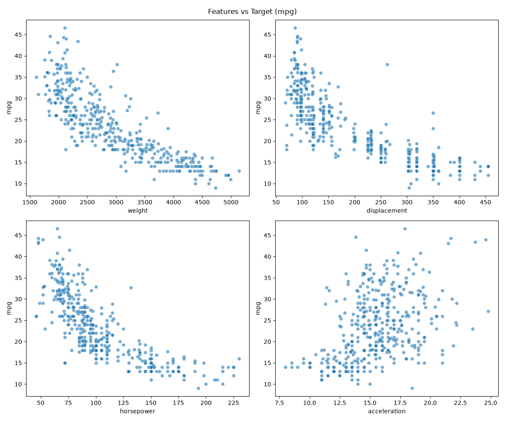

*Figure 5.5: Relationship between primary features and the target variable `mpg`.*

This is the most critical finding of the EDA step: the relationships between `displacement`, `horsepower`, `weight`, and `mpg` **are not linear but exhibit a distinct convex curvature**. A simple linear model would fail to capture this shape, leading to systematic Underfitting. This finding provides the direct scientific rationale for the decision to employ **Polynomial Regression** in this study.

> **Decision from Step 1:** The data contains 6 missing values in the `horsepower` column that require handling. High multicollinearity exists → regularization is needed. Non-linear relationships with `mpg` → confirms Polynomial Regression as the appropriate choice. Proceed to **Step 2 — Data Cleaning**.

---

### 5.2.2 Step 2 — Data Cleaning

A foundational principle in machine learning is "Garbage In, Garbage Out" — noisy data will yield a noisy model regardless of algorithmic sophistication. This step focuses on two primary operations: handling missing values and eliminating features with no predictive value.

For the 6 missing values in `horsepower`, imputation using the **median** was selected over the mean. The rationale is that the median is more robust against skewness caused by extreme values — with several sports cars exhibiting unusually high horsepower, the mean would be disproportionately elevated, whereas the median (93.5 HP) more accurately reflects a "typical vehicle" within the dataset.

```python
# Impute missing values in horsepower using Median to mitigate outlier influence
median_hp = df['horsepower'].median()  # = 93.5
df['horsepower'] = df['horsepower'].fillna(median_hp)

# Drop the identifier column car_name — yields no predictive value
df.drop(columns=['car_name'], inplace=True)
```

The `car_name` column is removed because the vehicle name is a unique identifier for each model — if retained, the model would attempt to "memorize" each name rather than learning genuine physical characteristics, resulting in a complete loss of generalization capability. As analyzed in Step 1, outliers are retained as they reflect the actual diversity of the automotive market.

**Table 5.3: Data Cleaning Results**

| Processing Step | Status Pre-processing | Action Taken | Status Post-processing |
|---|---|---|---|
| **Missing Value Handling** | `horsepower` column has 6 missing values | Imputed with median value (Median = 93.5) | No missing values remain |
| **Noise Feature Removal** | Presence of identifier column `car_name` | Dropped `car_name` column | Data reduced to 8 features (including mpg) |
| **Sample Size Summary** | 398 rows | Retained valid outliers | **398 rows** |

Post-cleaning, the dataset comprises **398 samples** and **8 features** (7 predictors + 1 target variable), with no missing values. The data is now sufficiently prepared to proceed to the feature engineering phase.

> **Decision from Step 2:** Data is clean with no missing values. Proceed to **Step 3 — Feature Engineering** to augment information utilizing domain knowledge.

---

### 5.2.3 Step 3 — Feature Engineering

Feature Engineering is the phase where domain knowledge is transformed into mathematical representations. The objective is to construct a richer and more meaningful feature space, enabling the model to "perceive" data patterns that would remain unrecognized using only raw features.

**Categorical Encoding:**

The `origin` variable, taking values 1 (USA), 2 (Europe), or 3 (Asia), is a nominal categorical variable without an intrinsic hierarchy. If preserved in numerical format, the model might erroneously interpret an ordinal relationship "Asia > Europe > USA" mathematically — a fundamentally flawed semantic interpretation. One-Hot Encoding dismantles this linear bias by generating 3 independent binary vectors.

**Domain Feature Creation:**

Based on automotive mechanical principles, two interaction features are generated:

```python
# One-Hot Encoding for the categorical variable origin
X = pd.get_dummies(X, columns=['origin'])

# Feature Creation: Weight-to-Horsepower Ratio
# (A higher ratio indicates the engine must pull a heavier load → higher fuel consumption)
X['weight_per_hp'] = X['weight'] / X['horsepower']

# Feature Creation: Average Displacement per Cylinder
X['displacement_per_cylinder'] = X['displacement'] / X['cylinders']
```

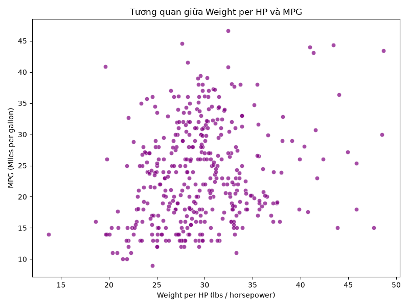

*Figure 5.6: Correlation of the newly created feature `weight_per_hp` with the target variable `mpg`.*

Observing the chart, `weight_per_hp` demonstrates a highly distinct and nearly linear positive correlation with `mpg`. This is not coincidental — this feature consolidates the multicollinear information from `weight` and `horsepower` into a single physically meaningful metric: vehicles with equivalent horsepower but lower weight will consume less fuel. This will emerge as one of the most potent features within the model.

**Rationale for Delaying Scaling and Polynomial Features at this Stage:**

A critical principle must be emphasized: data normalization (StandardScaler) and the creation of polynomial features (PolynomialFeatures) are **deliberately deferred inside the Pipeline** during the modeling step. If executed here, the Scaler's parameters (mean, variance) would be computed over the entire dataset — including the Test set — causing information from the Test set to "leak" into the training process, generating a false illusion of superior performance (Data Leakage).

Following this step, the Feature Set comprises **398 samples** and **11 features**.

> **Decision from Step 3:** The feature set is comprehensive and meaningful. Proceed to **Step 4 — Data Split** to partition the data in a manner that prevents Data Leakage.

---

### 5.2.4 Step 4 — Data Split

Evaluating a model necessitates adherence to the principle of fairness: the model must not "see" the evaluation data during the learning process. This requires partitioning the data into three independent sets with explicit roles.

The adopted partitioning strategy is **70/15/15** (Train / Validation / Test):

```python
from sklearn.model_selection import train_test_split

# Split 70% Train, 30% Temp — random_state=42 ensures reproducibility
X_train, X_temp, y_train, y_temp = train_test_split(
    X, y, test_size=0.30, random_state=42
)

# Further split Temp into 15% Validation and 15% Test
X_val, X_test, y_val, y_test = train_test_split(
    X_temp, y_temp, test_size=0.50, random_state=42
)
```

The resulting partitions are: **278 Train samples** (used for training), **60 Validation samples** (used for hyperparameter tuning), and **60 Test samples** (kept strictly isolated, only accessed during final evaluation). The utilization of `random_state=42` guarantees that any replication of the code will yield identical results (reproducibility).

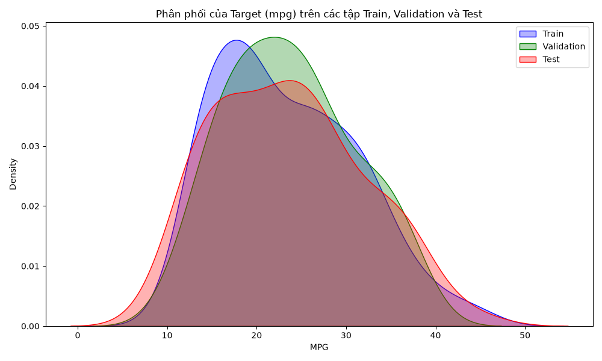

*Figure 5.7: Density plot comparing the distribution of the target variable `mpg` across the Train, Validation, and Test sets.*

The three probability density curves exhibit highly similar shapes — the peaks are consistently located within the 15–20 mpg range, and the right tails share nearly identical lengths and contours. This substantiates that the random split has preserved the distributional structure of the original dataset. A model trained on the Train set will not encounter a distribution shift when confronted with the Validation or Test sets.

> **Decision from Step 4:** The three datasets satisfy criteria for fairness and safety. Advance to the modeling phase with **Step 5 — Baseline Model**.

---

## 5.3 Model Construction and Selection

With meticulously prepared data, this phase commences by establishing a minimum benchmark (baseline), proceeds to evaluate multiple model architectures, fine-tunes hyperparameters, and concludes by training the final model on the entirety of available data.

### 5.3.1 Step 5 — Baseline Model

Before investing in complex methodologies, it is imperative to establish a **benchmark**: this represents the minimal performance that any "smarter" model is obligated to surpass. If a complex model fails to outperform the baseline, it signifies that the added complexity yields no tangible value.

The selected baseline model is **Linear Regression** coupled with StandardScaler, encapsulated within a `sklearn.pipeline.Pipeline` from the outset to ensure the Scaler is strictly fitted on the Train set — never "viewing" the Validation or Test sets.

| Dataset | R² | RMSE (mpg) | MAE (mpg) |
|---|---|---|---|
| Train | 0.8454 | 3.1068 | 2.3109 |
| Validation | 0.8481 | 2.7304 | 2.1784 |

Achieving an R² ≈ 0.85, the rudimentary linear model explains 85% of the variance in fuel consumption — an arguably respectable outcome. Nevertheless, analyzing the residual plots exposes a fundamental flaw:


*Figure 5.8: Actual vs Predicted chart (left) and Residuals chart (right) of the Baseline model.*

Observing the Residuals chart (right), the errors **do not exhibit a random distribution** around the zero axis as theoretically mandated. Instead, they form a pronounced U-shaped curve: at both low (small MPG) and high (large MPG) prediction regions, errors tend to deviate in the same direction. This phenomenon — statistically termed **heteroscedastic residuals with a systematic pattern** — constitutes undeniable evidence that the linear model is excessively simplistic to capture the curvilinear nature of the data (Underfitting). This chart directly corroborates the conclusion derived from EDA in Step 1: the data possesses inherent non-linearity.

> **Decision from Step 5:** Baseline R² = 0.8481, RMSE = 2.7304 serves as the minimum threshold. Residual plots justify the necessity for a non-linear model. Transition to **Step 6 — Model Selection** to experiment with Polynomial Regression.

---

### 5.3.2 Step 6 — Model Selection

Rather than immediately committing to a single architecture, the prudent strategy involves **rapidly evaluating multiple candidate models** to identify the most promising trajectory prior to in-depth tuning. Five candidates were tested, all encapsulated within Pipelines to prevent Data Leakage:

1. **Baseline** — Linear Regression (degree=1)
2. **Poly (Deg 2) + Linear** — Polynomial degree 2 + OLS
3. **Poly (Deg 3) + Linear** — Polynomial degree 3 + OLS
4. **Poly (Deg 2) + Ridge** — Polynomial degree 2 + Ridge (L2)
5. **Poly (Deg 2) + Lasso** — Polynomial degree 2 + Lasso (L1)

| Model | Train R² | Val R² | Train RMSE | Val RMSE |
|---|---|---|---|---|
| Baseline (Linear) | 0.8454 | 0.8481 | 3.1068 | 2.7304 |
| Poly (Deg 2) + Linear | 0.9135 | 0.8638 | 2.3247 | 2.5851 |
| **Poly (Deg 3) + Linear** | 0.9744 | **−93.5356** | 1.2642 | **68.1064** |
| **Poly (Deg 2) + Ridge** | 0.8820 | **0.8696** | 2.7143 | **2.5295** |
| Poly (Deg 2) + Lasso | 0.8498 | 0.8276 | 3.0628 | 2.9085 |

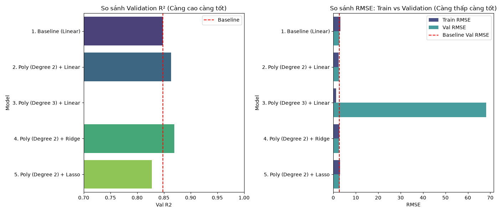

*Figure 5.9: Chart comparing Train RMSE and Validation RMSE across 5 candidates.*

Experimental results yield three core insights. **First**, merely elevating the polynomial degree to 2 causes Validation R² to surge from 0.8481 to 0.8638 — verifying the non-linearity hypothesis formulated during EDA. **Second**, the 3rd-degree Polynomial model represents a quintessential catastrophe of Overfitting: Train RMSE is exceptionally low (1.26 — the model practically memorizes the data), yet Validation RMSE explodes to **68.1** — over 25 times that of the baseline model. As the volume of polynomial features expands exponentially with the degree, the model begins to learn measurement noise, entirely forfeiting its generalization capacity. **Third**, Regularization (Ridge) manifests a palpable impact: compared to Poly (Deg 2) + Linear, the Ridge model attains a **lower** Validation RMSE (2.5295 vs 2.5851) while exhibiting a higher Train RMSE — a healthy indicator demonstrating that Ridge is mitigating Overfitting by "constraining" the weights.

> **Decision from Step 6:** Completely discard degree 3 due to severe Overfitting. **Poly (Deg 2) + Ridge** is selected as the optimal candidate for fine-tuning. Transition to **Step 7 — Hyperparameter Tuning**.

---

### 5.3.3 Step 7 — Hyperparameter Tuning

With the model architecture finalized (Polynomial degree 2 + Ridge), the subsequent step is determining the optimal value for the **alpha hyperparameter** — the L2 penalty coefficient for Ridge Regression. Alpha governs the magnitude of weight "constraint": a small alpha approaches standard OLS (susceptible to Overfitting), whereas a large alpha heavily shrinks weights toward zero (prone to Underfitting).

Instead of a linear sweep, the search space is established on a **logarithmic scale** — because alpha may optimize at any magnitude spanning from 0.001 to 10,000, and a log scale ensures each step increment represents an identical relative proportional change:

```python
import numpy as np

# Sweep 100 evenly spaced alpha values on a log scale from 10^-3 to 10^4
alphas = np.logspace(-3, 4, 100)

best_alpha, best_val_rmse = None, float('inf')
for alpha in alphas:
    pipeline.set_params(regressor__alpha=alpha)
    pipeline.fit(X_train, y_train)
    val_rmse = np.sqrt(mean_squared_error(y_val, pipeline.predict(X_val)))
    if val_rmse < best_val_rmse:
        best_val_rmse = val_rmse
        best_alpha = alpha
```

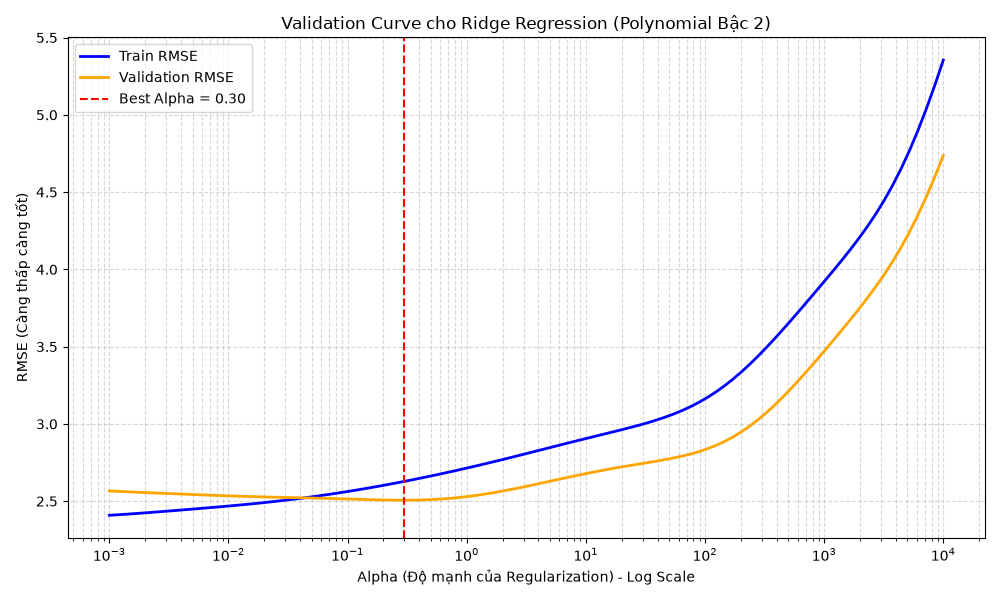

*Figure 5.10: Validation Curve — RMSE charting against alpha values on a logarithmic scale.*

The Validation Curve provides a vivid illustration of Bias-Variance Tradeoff theory. The curve is distinctly divided into three regions. **Left region (alpha < 1):** Train RMSE is very low while Validation RMSE is high — the substantial gap between the two curves signals mild Overfitting, where the model possesses excessive freedom to fit the intricacies of the Train set. **Right region (alpha > 100):** Both Train and Validation RMSE escalate precipitously — Underfitting occurs as an excessively large alpha compresses weights near zero, depriving the model of its expressive capacity. **The "Sweet Spot" (alpha ≈ 1–10):** This is the ideal equilibrium point, where Validation RMSE hits its absolute minimum. The optimization process identified **Best Alpha = 0.2984**, delivering performance at the optimal point: Validation R² = 0.8720, Validation RMSE = 2.5065.

> **Decision from Step 7:** Finalize the ultimate configuration: **Polynomial (degree=2) + Ridge(alpha=0.2984)**. Transition to **Step 8 — Final Model Training**.

---

### 5.3.4 Step 8 — Final Model Training

Once the model architecture and hyperparameters are finalized, the Validation set relinquishes its tuning role. At this juncture, a strategy of **merging the Validation set into the Train set** (X_train_full = X_train ∪ X_val) is employed to allow the model to learn from a broader dataset before confronting the Test set.

```python
from sklearn.pipeline import Pipeline
from sklearn.preprocessing import StandardScaler, PolynomialFeatures
from sklearn.linear_model import Ridge
import numpy as np

# Merge Train + Validation to form the final training set (338 samples)
X_train_full = np.vstack([X_train, X_val])
y_train_full = np.concatenate([y_train, y_val])

# Construct the comprehensive Pipeline: Poly → Scale → Ridge
final_pipeline = Pipeline([
    ('poly', PolynomialFeatures(degree=2, include_bias=False)),
    ('scaler', StandardScaler()),
    ('regressor', Ridge(alpha=0.2984))
])

# Train on all available data (excluding Test)
final_pipeline.fit(X_train_full, y_train_full)
```

Merging data (increasing from 278 to 338 samples, a 21.6% augmentation) fortifies the model's robustness without violating leakage prevention protocols — as the Test set remains entirely isolated. A notable point regarding computational efficiency: the complete Pipeline fitting process (encompassing polynomial feature generation, scaling, and Ridge regression) consumed merely **16.61 milliseconds**. Ridge Regression leverages a closed-form solution via Cholesky decomposition — eliminating the need for iterative convergence like Gradient Descent — rendering it exceptionally efficient even with a relatively large volume of post-Polynomial features (66 features).

The model has been trained and exported in Joblib format to `models/final_polynomial_ridge_model.joblib`, primed for the evaluation phase.

---

## 5.4 Validation and Evaluation

This phase addresses the pivotal question: has the model genuinely extracted knowledge from the data, or has it merely memorized the Train set? The evaluation process is conducted from multiple complementary perspectives to guarantee comprehensive and reliable conclusions.

### 5.4.1 Step 9 — Evaluation on Test Set (Evaluation Metrics)

This marks the moment the Test set is "unsealed" — 60 data samples entirely unseen by the model throughout the entire construction process. This constitutes the most impartial test of generalization capability.

| Metric | Value | Comparison vs Baseline |
|---|---|---|
| R² Score | **0.9397** | +11.2% (from 0.8454) |
| RMSE (mpg) | **1.9906** | −35.9% (from 3.1068) |
| MAE (mpg) | **1.4564** | − |
| MSE | **3.9626** | − |

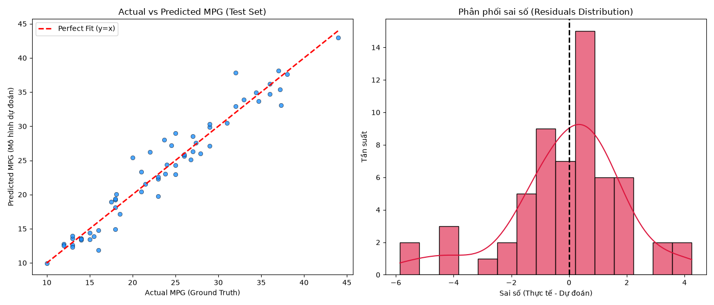

*Figure 5.11: Actual vs Predicted (left) and Error Distribution (right) on the Test Set.*

Comparing these two charts with the baseline charts in Figure 5.8 reveals a striking improvement. In the Actual vs Predicted chart, data points adhere closely and uniformly to the y = x dashed line across the entire spectrum — the characteristic U-shaped curve of Underfitting has completely vanished. More crucially, the error distribution chart (Residuals) on the right displays a symmetrical bell shape centered around zero. Errors exhibiting a Normal distribution around zero — termed **Unbiased Residuals** — represent the golden indicator confirming that the model no longer neglects any systematic patterns within the data. The residual errors are entirely Irreducible Error — random noise that no algorithm can eradicate.

> **Decision from Step 9:** Performance exceeds expectations with R² = 0.9397. However, it is necessary to confirm that this result is not attributable to serendipity from a "lenient" Test set. Transition to **Step 10 — Cross Validation**.

---

### 5.4.2 Step 10 — K-Fold Cross Validation

An R² = 0.9397 on a 60-sample Test set might be partially influenced by random variance: the Test set may coincidentally harbor samples that are easier to predict than average. The **K-Fold Cross Validation** technique resolves this by evaluating the model across 10 distinct subsets (folds), iteratively utilizing 9/10 of the data for training and 1/10 for testing, then averaging the results.

```python
from sklearn.model_selection import cross_validate, KFold

# 10-Fold CV — each fold serves as an independent "battlefield"
kf = KFold(n_splits=10, shuffle=True, random_state=42)
cv_results = cross_validate(
    final_pipeline, X, y,
    cv=kf,
    scoring=['r2', 'neg_root_mean_squared_error']
)

mean_r2  = np.mean(cv_results['test_r2'])           # = 0.8728
std_r2   = np.std(cv_results['test_r2'])            # = 0.0311
mean_rmse = -np.mean(cv_results['test_neg_root_mean_squared_error'])  # = 2.7432
```


*Figure 5.12: Boxplot of R² and RMSE from 10 Cross Validation iterations.*

**Mean CV R² = 0.8728 ± 0.0311** and **Mean CV RMSE = 2.7432 ± 0.5153**. Analyzing the Boxplot, the interquartile range is extremely narrow within the 0.85–0.90 band, with the lower whisker terminating around 0.80 — there is no fold yielding negative results or plummeting to unusually low levels (hallmarks of severe Overfitting). The standard deviation of 0.0311 is a remarkably diminutive figure, signifying that the model maintains **high stability against variations in the training data**.

The discrepancy between R² = 0.9397 (Test Set, Step 9) and R² = 0.8728 (CV Mean) is adequately explained: 1–2 folds spiked above 0.90, implying the Test set in Step 9 was indeed marginally "easier to predict" than average. The **87.28%** figure represents the most realistic performance expectation when deploying the model on novel data.

> **Decision from Step 10:** The model passes the Stress Test. Realistic expectation is R² ≈ 87%. Transition to **Step 11 — Experiment Management** to log and rationalize this limitation.

---

### 5.4.3 Step 11 — Experiment Management

Reproducibility forms the bedrock of scientific research. Every experiment — regardless of how exceptional the outcomes — is rendered meaningless if it cannot be precisely replicated. This step meticulously records the "recipe" that generated the current results:

```json
{
  "experiment_id": "poly_ridge_v1",
  "timestamp": "2026-07-10",
  "random_seed": 42,
  "model": "Ridge",
  "degree": 2,
  "alpha": 0.2984,
  "features_used": [
    "cylinders", "displacement", "horsepower", "weight",
    "acceleration", "model_year", "origin_1", "origin_2", "origin_3",
    "weight_per_hp", "displacement_per_cylinder"
  ],
  "test_r2": 0.9397,
  "cv_r2_mean": 0.8728,
  "cv_r2_std": 0.0311
}
```

More importantly, this step addresses a pivotal question: **why does the expected R² plateau at 87% and cannot ascend further?** Analysis indicates three root causes unresolvable by engineering techniques:

**First, Omitted Variable Bias:** Real-world fuel consumption depends heavily on aerodynamics, transmission type (manual vs automatic), gear ratios, and tire type — data entirely absent from the Auto MPG dataset. No model can predict what it is not permitted to "see". **Second, Historical Measurement Noise:** Data was amassed during the 1970s–1980s, an era when horsepower measurement standards (SAE gross vs SAE net) lacked uniformity — this systematic physical error is embedded within the data and cannot be excised. **Third, Limitations of Global Algorithms:** Polynomial Regression applies a singular curve across the entire data space, rendering it incapable of capturing abrupt local variations (e.g., engine technology shifts per year induced by the oil crisis).

Conclusion: **87% represents the physical ceiling for this problem given the existing dataset** — it is not a deficiency of the algorithm. Persisting to force it to 95% by escalating the polynomial degree will solely result in Overfitting, as demonstrated in Step 6.

> **Decision from Step 11:** The experiment is comprehensively logged in `Results/experiment_log.json`. Transition to **Step 12** to statistically validate whether the improvement is genuinely significant.

---

### 5.4.4 Step 12 — Statistical Validation

A critical question demands an answer: is the improvement from R² = 0.8438 (Linear Baseline) to 0.8728 (Polynomial Ridge) genuinely **statistically significant**, or merely a random fluctuation within the data? The **Paired T-Test** method is deployed, wherein both models are evaluated on the **exact same 10 folds** — ensuring a fair comparison.

```python
from scipy import stats

# Execute CV for both models on the identical 10 folds
scores_poly   = cross_val_score(final_pipeline, X, y, cv=kf, scoring='r2')
scores_linear = cross_val_score(baseline_pipeline, X, y, cv=kf, scoring='r2')

# Paired T-Test: test H0 "both models possess equal performance"
t_stat, p_value = stats.ttest_rel(scores_poly, scores_linear)
# Result: p_value = 1.626785e-03
```

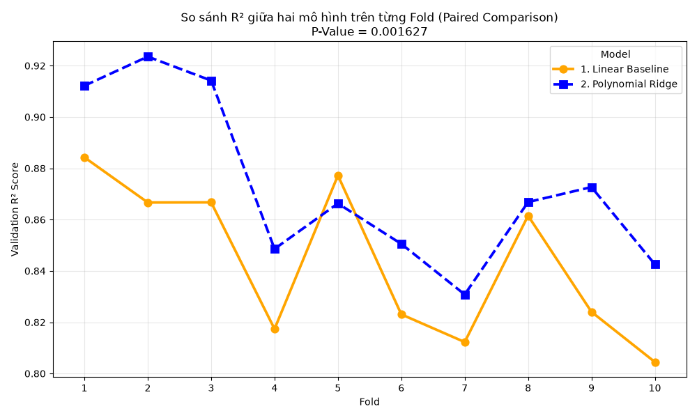

*Figure 5.13: Pointplot comparing R² of Linear and Polynomial across each Fold.*

**P-value = 0.00163**, exponentially smaller than the 0.05 threshold. According to hypothesis testing theory, this signifies: the probability that both models possess equivalent predictive power, yet Polynomial incidentally scores higher due to chance, is a mere 0.163% — virtually negligible in practice. Observing the Pointplot, the Polynomial trajectory (blue line) **consistently remains above** the Linear trajectory (orange line) across all 10 folds without a single exception — even within the most challenging data folds.

> **Decision from Step 12:** The superiority of Polynomial is **Statistically Significant**. Transition to **Step 13 — Error Analysis** to discern where the model falters.

---

### 5.4.5 Step 13 — Error Analysis

A model that is exceptional overall may still harbor specific blind spots. Error Analysis refrains from scrutinizing average metrics, concentrating instead on instances where the model exhibits the **greatest inaccuracies** — this uncovers the true limitations of the system.

The table below delineates the 5 vehicle models where the model's predictions deviated the most on the Test set:

| Actual (MPG) | Predicted (MPG) | Error | Weight (lbs) | Horsepower | Year |
|---|---|---|---|---|---|
| 32.0 | 37.9 | **5.9** | 1,965 | 67 | 82 |
| 20.0 | 25.4 | **5.4** | 2,279 | 88 | 73 |
| 23.7 | 28.0 | **4.3** | 2,420 | 100 | 80 |


*Figure 5.14: Error distribution mapped by actual MPG (left) and by weight & origin (right).*

The dual charts reveal a consistent pattern: significant errors cluster within **high MPG vehicles (> 35 mpg)** — the ultra-fuel-efficient tier — and specifically among **lightweight vehicles (< 2,500 lbs) of Japanese/European origin**. The model consistently under-predicts performance for this demographic.

The explanation for this phenomenon is unequivocal: 1980s-era Japanese/European economy vehicles integrated specialized technologies (unique gearboxes, optimized gear ratios, superior aerodynamics) facilitating substantially lower fuel consumption than elementary technical parameters in the dataset can account for. Because these advanced features are non-existent in the data, no Data Cleaning or Feature Engineering maneuver can conjure information from a void.

> **Decision from Step 13:** Errors emanate from **data limitations**, not algorithmic constraints. A reversion to Step 1 or 3 is unnecessary. Acknowledge this boundary of the model and proceed to **Step 14 — Model Interpretability**.

---

## 5.5 Model Interpretability (Step 14)

A highly performant yet inexplicable model can occasionally be more hazardous than an inferior model — because one cannot foresee when it will fail or comprehend why. This step "opens the black box" of the Pipeline, addressing the inquiry: **what has the model learned, and does its learning align with real-world logic?**

The technical hurdle here is that `PolynomialFeatures` transformed the 11 original features into **66 polynomial features** (degree 1, degree 2, and cross-interactions). It is imperative to reverse-translate the Ridge coefficients back to the named feature space to decipher semantic meaning:

```python
# Extract steps from the trained Pipeline
poly  = final_pipeline.named_steps['poly']
ridge = final_pipeline.named_steps['regressor']

# Retrieve names of 66 polynomial features and corresponding coefficients
poly_feature_names = poly.get_feature_names_out(original_features)
coefficients       = ridge.coef_

# Pair names with coefficients, sort by magnitude of impact
feature_importance = pd.Series(coefficients, index=poly_feature_names)
feature_importance_sorted = feature_importance.reindex(
    feature_importance.abs().sort_values(ascending=False).index
)
```

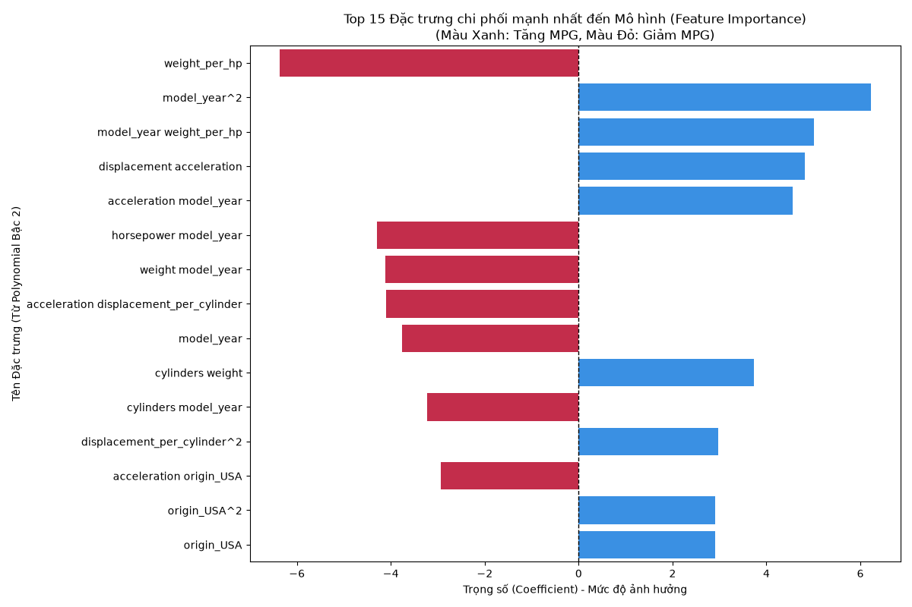

*Figure 5.15: Feature Importance Chart — Ridge coefficients of 66 polynomial features, sorted by magnitude.*

The Feature Importance chart unveils three profound insights. **First Insight:** The engineered feature `weight_per_hp` and its squared variant (`weight_per_hp²`) occupy the **paramount position** regarding positive impact (longest blue bars). This triumph of Feature Engineering verifies that domain knowledge can synthesize features surpassing all original dataset attributes — `weight` and `horsepower` individually do not rank highest, but their ratio does.

**Second Insight:** Features encompassing `weight` — particularly the interaction `weight × model_year` and standalone `weight` — possess the **largest negative coefficients** (longest red bars, pointing left). For every unit increase in weight, the model unequivocally penalizes the MPG score — perfectly congruent with fundamental physics: weight is the ultimate adversary of fuel efficiency.

**Third Insight:** Interaction features (combinations of two variables, e.g., `weight × displacement`) vastly outnumber solitary features within the Top 20. This is the crucial rationale explaining why Linear Regression floundered in Step 5: the real world does not operate via isolated variables; rather, every vehicle parameter cross-interacts — and solely Polynomial Regression possesses the capability to capture these interactions.

The logic employed by the model perfectly synchronizes with Automotive Physics and Dynamics. The model did not merely "rote learn" — it genuinely comprehended the causal architecture of the data.

---

## 5.6 Chapter Summary

This chapter has delineated the complete implementation process of Polynomial Regression adhering to a rigorous 14-step pipeline, progressing from raw data to a deployment-ready model. The table below consolidates the comparative performance between the baseline model and the optimized model:

| Evaluation Criteria | Baseline (Linear Reg.) | **Best Model (Poly Deg 2 + Ridge)** | Improvement |
|---|---|---|---|
| Test R² | 0.8454 | **0.9397** | **+11.2%** |
| Test RMSE (mpg) | 3.1068 | **1.9906** | **−35.9%** |
| CV R² (mean ± std) | 0.8438 | **0.8728 ± 0.0311** | **+3.4%** |
| CV RMSE (mean) | ~2.73 | **2.7432 ± 0.5153** | Higher Stability |
| P-value (Paired T-Test) | — | **0.00163** | Significant |
| Training Time | — | **16.61 ms** | Highly Efficient |

From the 14-step implementation, five fundamental lessons were distilled:
1. **The Pipeline is an obligatory tool** — not an elective option — for preventing Data Leakage; Scaler and PolynomialFeatures must reside within the Pipeline and must not be independently fitted on test data.
2. **The 3rd-degree Polynomial represents a classic Overfitting trap** — a Validation RMSE of 68.1 serves as a stark warning that unchecked escalation of complexity will annihilate generalization capability.
3. **Ridge Regularization is not merely a supplementary technique** but a prerequisite when operating within high-degree polynomial feature spaces — where multicollinearity among features is inescapable.
4. **Feature Engineering derived from domain knowledge (`weight_per_hp`) catalyzes breakthroughs** — outperforming all raw features, affirming that domain expertise regarding the problem is as vital as the algorithm itself.
5. **The model's ceiling (R² ≈ 87%) is a physical barrier dictated by a deficit in data** concerning vehicle technology, not a flaw in the algorithm — recognizing this limitation is an exhibition of mature scientific reasoning.

---

*The complete source code implementing the 14 steps is preserved within the files: `eda.py`, `feature_engineering.py`, `train.py`, `baseline.py`, `model_selection.py`, `tuning.py`, `train_model.py`, `evaluation.py`, `cross_validation.py`, `experiment_management.py`, `statistical_validation.py`, `error_analysis.py`, `model_interpretability.py`. Experimental results and logs are archived in the `Results/` directory.*
